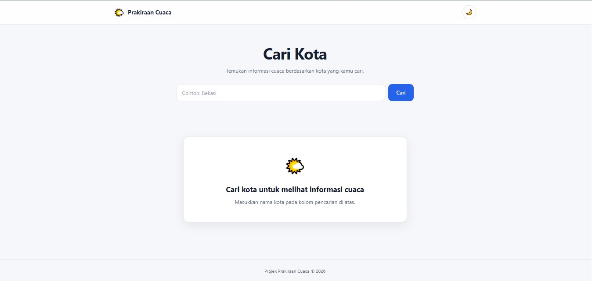
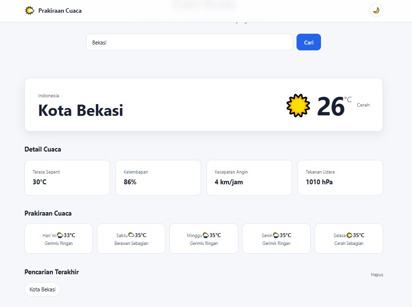
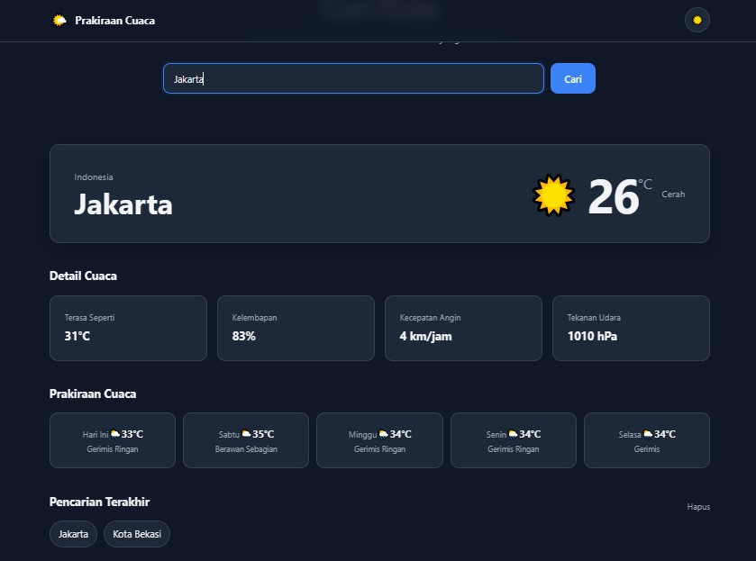
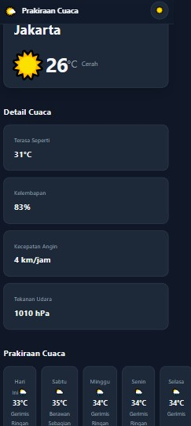
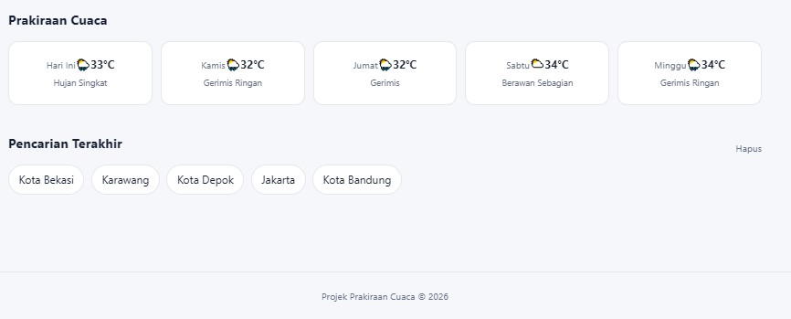
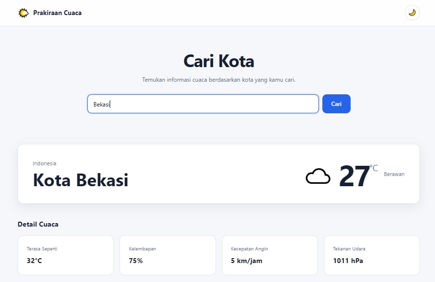

# 🌤️ Weather Dashboard

Weather Dashboard adalah aplikasi web sederhana untuk mencari dan menampilkan informasi cuaca berdasarkan nama kota.

Aplikasi mengambil data cuaca secara real-time menggunakan REST API, kemudian mengolah response JSON menggunakan JavaScript dan menampilkannya dalam antarmuka yang modern, minimalis, dan responsive.

## Screenshots

### Dashboard Cuaca


### Hasil Pencarian


### Hasil Pencarian (Dark Mode)


### Tampilan Mobile (Dark Mode)


### Prakiraan Cuaca Besok & History


### Tampilan Pencarian


## Features

- Search weather by city
- Current weather
- Temperature
- Feels like temperature
- Humidity
- Wind speed
- Atmospheric pressure
- Weather condition
- 5-day weather forecast
- Recent searches
- Dark mode
- Loading state
- Error handling
- Responsive design
- LocalStorage

## Tech Stack

- HTML5
- CSS3
- JavaScript
- REST API
- JSON
- Fetch API
- Async/Await
- LocalStorage

## API

Project ini menggunakan Open-Meteo untuk mengambil data lokasi dan cuaca.

API yang digunakan:

- Open-Meteo Geocoding API
- Open-Meteo Weather API

## Project Structure

```text
weather-dashboard/
│
├── index.html
│
├── css/
│   └── style.css
│
├── js/
│   └── app.js
│
├── assets/
│   └── icons/
│
├── .gitignore
├── README.md
└── PROJECT_REQUIREMENTS.md